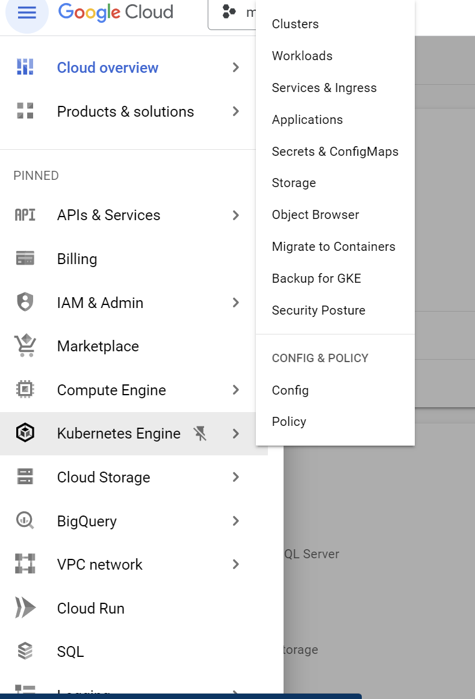

# GKEGideline

This is a simple guide for deploying a web application with a React front-end framework, a Go backend,
and MongoDB as the database using google kubernetes engine.

### Prerequisites

* Docker
* Kubernetes
* Google cloud account 

### Steps
1. After login in your google cloud account you should select the navigation  menu and select Kubernets Engine 
2. select cluster then select create (I went for basic cluster)
3. open the console and get your source code from git or your pc
4. build your code using your docker files and push the images to a remote url 
   ``` 
   docker build -t [ImageName] [Path]
   docker push [ImageName]
   ```
5. Go to the VPC  Network and get 4 External ips (mongodb-ip,backend-ip,forntend-ip, ingress-ip) 
6. you need to create 7 yaml files as following
    * mongo-deployment.yaml
   ```
    apiVersion: apps/v1
    kind: Deployment
    metadata:
    name: mongo-deployment
    spec:
    replicas: 1
    selector:
    matchLabels:
    app: mongo
    template:
    metadata:
    labels:
    app: mongo
    spec:
    containers:
    - name: mongo
    image: mongo:latest
    ports:
      - containerPort: 27017

     ```

    * mongo-service.yaml
   ```
   apiVersion: v1
   kind: Service
   metadata:
   name: mongo-service
   spec:
   type: LoadBalancer
   loadBalancerIP: [mongodb-ip]
   selector:
   app: mongo
   ports:
   - port: 27017
   targetPort: 27017
   ```
    * go-deployment.yaml (if your server doesn't have a empty rout that return 200 create one or add 
   a custom route like helloHandler in the example below )
   ```
    apiVersion: apps/v1
    kind: Deployment
    metadata:
    name: go-server
    spec:
    replicas: 1
    selector:
    matchLabels:
    app: go-server
    template:
    metadata:
    labels:
    app: go-server
    spec:
    containers:
   - name: go-server
    image: [BackendImageName]
    readinessProbe:
      httpGet:
        path: /helloHandler
        port: 12345
        httpHeaders:
        - name: Host
          value: morseverse.org          
    ports:
    - containerPort: 12345
      name: http
    env:
    - name: MONGODB_URL
      value: mongodb://mongodb-service:27017
 
   ```
    * go-service.yaml
   ```
   apiVersion: v1
   kind: Service
   metadata:
   name: go-server
   spec:
   type: LoadBalancer
   loadBalancerIP: [backend-ip]
   selector:
   app: go-server
   ports:
   - protocol: TCP
   port: 80
   targetPort: 12345
   name: http
   ```
    * react-deployment.yaml
   ```
   apiVersion: apps/v1
   kind: Deployment
   metadata:
   name: react-app
   spec:
   replicas: 2
   selector:
   matchLabels:
   app: react-app
   template:
   metadata:
   labels:
   app: react-app
   spec:
   containers:
   - name: react-app
   image: [FrontEndImage]
   ports:
     - containerPort: 3000
     env:
     - name: GO_SERVER_URL
     value: http//go-server:12345
     - name: MONGODB_URL
     value: mongodb://mongodb-service:27017

     ```
    * react-service.yaml
   ```
   apiVersion: v1
   kind: Service
   metadata:
   name: react-app-service
   spec:
   selector:
   app: react-app
   ports:
   - name: http
    port: 80
    targetPort: 3000
   ```
    * ingress.yaml
     ```
   apiVersion: networking.k8s.io/v1
   kind: Ingress
   metadata:
   name: morseverse-ingress
   annotations:
   kubernetes.io/ingress.class: "gce"
   kubernetes.io/ingress.global-static-ip-name: ingress-ip
   spec:
   defaultBackend:
   service:
   name: react-app-service
   port:
   number: 80
   rules:
   - host: [Domainname]
   http:
   paths:
     - path: /api/v1/*
     pathType: ImplementationSpecific
     backend:
     service:
     name: go-server
     port:
     number: 80        
     - path: /*
     pathType: ImplementationSpecific
     backend:
     service:
     name: react-app-service
     port:
     number: 80

   ```
7. deploy all the files using this command 
    ```
    kubectl apply -f mongo-deployment.yaml 
    kubectl apply -f mongo-service.yaml
    kubectl delete -f go-service.yaml
    kubectl delete -f go-deployment.yaml
    kubectl apply -f react-deployment.yaml
    kubectl apply -f react-service.yaml
    kubectl apply -f ingress.yaml
   ```
8. go to the firewall and open the access to ips and ports mentioned in the seeting files 
9. you can check the state of your deployment using this command 
    ```
    kubectl get deployment
    kubectl get services
    kubectl get pods
   ```
10. go to the domain provider and map your ingress ip to your domain name (use @ as host name type A and ingress-ip)
  